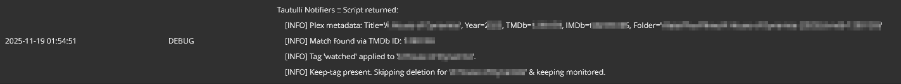
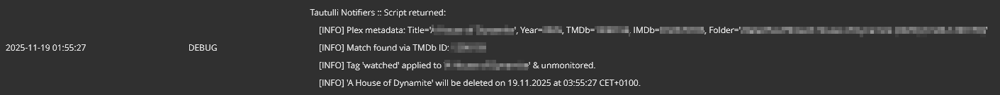

# Radarr Auto Tag for Tautulli

This script tags watched Plex movies in Radarr and schedules
movie file deletion through a persistent queue.

## Features

- Reads Plex metadata from the `rating_key` passed by Tautulli.
- Matches the Radarr movie by TMDb ID, IMDb ID, folder path,
  or title/year fallback.
- Adds the `watched` tag in Radarr.
- Sets `monitored=false` when no `keep` tag is present.
- Stores delayed deletions in `radarr_movie.pending.json`.
- Processes due queue entries on later runs or through `--run-pending`.
- Works inside the Tautulli container and on the Unraid host.
- Falls back to Python standard library HTTP handling when
  `requests` is not installed.

## Files

- `radarr_movie.py`
  Main script.
- `.env.example`
  Example environment file for the required variables.
- `radarr_movie.pending.json`
  Persistent deletion queue.
- `radarr_movie.pending.json.lock`
  Queue lock file used to avoid concurrent writes.

## Environment Variables

The script is configured through container environment variables:

- `RADARR_URL`
- `RADARR_API_KEY`
- `PLEX_URL`
- `PLEX_TOKEN`
- `WATCHED_TAG_LABEL`
- `KEEP_TAG_LABEL`
- `DELETION_DELAY_SECONDS`
- `REQUEST_TIMEOUT_SECONDS`

Typical values:

```env
RADARR_URL=http://radar:7878
RADARR_API_KEY=your_radarr_api_key
PLEX_URL=http://plex:32400
PLEX_TOKEN=your_plex_token
WATCHED_TAG_LABEL=watched
KEEP_TAG_LABEL=keep
DELETION_DELAY_SECONDS=7200
REQUEST_TIMEOUT_SECONDS=10
```

A ready-to-copy template is included as `.env.example`.

These values should be injected into the Tautulli container by your
Compose stack.
An optional local `.env` file can be kept next to the script for
manual runs, but Tautulli does not load that file automatically.

## Setup

### Prerequisites

- Tautulli is installed and connected to your Plex server.
- Radarr is running and API access is enabled.
- You know your Plex token. ([Finding an authentication token / X-Plex-Token](https://support.plex.tv/articles/204059436-finding-an-authentication-token-x-plex-token/))
- The script file `radarr_movie.py` is placed in
  `/config/scripts/auto_tag/`.
- The required environment variables are set in your Tautulli
  container.

### 1. Create the Radarr Tags

1. Open any movie in Radarr.
2. Edit the movie and add the tags `watched` and `keep`.
3. Save the movie.
4. Go to `Settings > Tags` and confirm both tags now exist.
5. Open the same movie again and remove both tags.
6. Save the movie once more.
7. Leave the tags available in Radarr for future use.

This creates both tags in Radarr ahead of time. After that, you can
assign the `keep` tag to any movie that should not be deleted after
being watched.

### 2. Prepare the Script Files

1. Create the folder `/config/scripts/auto_tag/` in your Tautulli
   config path if it does not already exist.
2. Copy `radarr_movie.py` into that folder.
3. Use `.env.example` as the template for the required environment
   variables.
4. Add those variables to your Tautulli Compose stack or its
   referenced `.env` file.
5. Recreate or redeploy the Tautulli container so the new variables
   are available to the script.

### 3. Configure the Tautulli Notification Agent

1. Open Tautulli.
1. Go to `Settings > Notification Agents`.
1. Add a new notification agent of type `Script`.
1. In the `Configuration` tab, set the script folder to:

```bash
/config/scripts/auto_tag/
```

1. Select `radarr_movie.py` as the script file.
1. Set any description you like.
1. In the `Triggers` tab, enable `Watched`.
1. In the `Conditions` tab, add:

- `Media Type is not Episode`

1. In the `Arguments` tab, use:

```bash
{rating_key}
```

1. Save the notification agent.

`{title}` and `{year}` are still accepted by the script as optional
override arguments, but they are no longer required for the normal
Tautulli workflow.

### 4. Align the Watched Threshold

1. In Plex, go to `Settings > Library`.
2. Set `Video played threshold` to the value you want.
3. In Tautulli, go to `Settings > General`.
4. Set `Movie Watched Percentage` to the same value.

This ensures Plex and Tautulli agree on when a movie counts as
watched and when the script should run. I personally use `95%`.

### 5. Optional Queue Processing Schedule

1. If you want queue processing independent from new playback events,
   schedule `--run-pending`.
2. The recommended Unraid host command is:

```bash
docker exec tautulli python3 /config/scripts/auto_tag/radarr_movie.py --run-pending
```

## How It Works

1. Tautulli starts the script with a Plex `rating_key`.
2. The script loads Plex metadata and finds the corresponding movie in Radarr.
3. The `watched` tag is applied.
4. If the movie does not have the `keep` tag, `monitored` is set to `false`.
5. The movie file deletion is added to
   `radarr_movie.pending.json` with a future `delete_after`
   timestamp.
6. A later run processes the queue and deletes the movie file when
   the due time is reached.

The queue feature exists specifically to preserve pending deletions
when the Tautulli container is restarted before the scheduled delete
time is reached.

If a queued deletion is due at `04:00` and the queue is processed
at `03:10`, nothing is deleted yet. The entry stays in the queue
until a run after `04:00`.

## Queue Processing

To process pending deletions without a playback event:

```bash
python3 /config/scripts/auto_tag/radarr_movie.py --run-pending
```

From the Unraid host, the recommended command is:

```bash
docker exec tautulli python3 /config/scripts/auto_tag/radarr_movie.py --run-pending
```

Direct host execution also works, but only if the required
environment variables are exported first.

## Optional Host Cron Job

You can optionally process the queue from the Unraid host with cron.

Recommended example command:

```bash
docker exec tautulli python3 /config/scripts/auto_tag/radarr_movie.py --run-pending
```

Direct host execution example with exported variables:

```bash
set -a
. /mnt/user/appdata/komodo/repos/homelab/tautulli/.env
set +a
python /mnt/user/appdata/tautulli/scripts/auto_tag/radarr_movie.py --run-pending
```

### Daily at 04:00

Schedule:

```cron
0 4 * * *
```

Command:

```bash
docker exec tautulli python3 /config/scripts/auto_tag/radarr_movie.py --run-pending
```

If you want deletions to happen closer to `DELETION_DELAY_SECONDS`,
use a more frequent schedule such as every 5 or 10 minutes.

## How to Check if It Worked

1. Watch a movie for longer than the `Ignore Interval` configured
   in `Tautulli > Settings > General`.
1. If you are using the `Watched` trigger, make sure the movie also
   passes your watched threshold.
1. In Tautulli, open `View Logs`.
1. If the movie has the `keep` tag, the log should look similar to
   this:



1. If the movie does not have the `keep` tag, the log should look
   similar to this and the file should be queued for deletion:



## Notes

- The `keep` tag prevents deletion.
- Queue timestamps are stored in UTC.
- Log output is formatted in local time.
- If Radarr has already removed the movie file, the queue entry is
  treated as completed on the next run.
