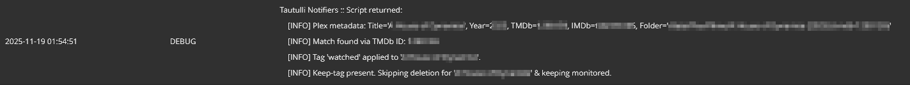
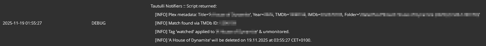

# Auto Tag & optionally delete watched movie

## What it does

With the help of Tautulli, this will automatically tag a movie after it has been
watched, unmonitor it in Radarr and deletes the movie file afterwards. If the movie has
a `keep` tag, the script optionally keeps the movie file, keeps it monitored and tags it as watched.

The script will not be triggered, if manually setting a movie to watched in Plex.
  

## Useful in which situation

I am not keeping any watched movies on my drives, but I want to keep a history, if I already
watched a movie or not. For that I added a `watched` label in Radarr.

And also sometimes I want to keep a movie, after I watched it - or my daughter wants to see a certain movie for the 5th time...
  

## Requirements

- Completely set up Plex instance & known X-Plex Token ([Finding an authentication token / X-Plex-Token](https://support.plex.tv/articles/204059436-finding-an-authentication-token-x-plex-token/))
- Completely set up Radarr instance
- Completely set up Tautulli instance, connected to your Plex instance
  

## Setup

1. Add `watched` and `keep` tag to 1 movie in Radarr:
   1. Click on a movie.
   2. Click on edit.
   3. In the tags section add i.e. `watched` and `keep` as two tags and click on `Save`.
      1. If you now go to `Settings` -> `Tags` you should see both tags linked to 1 movie.
   4. Click on the same movie and remove both tags and click on `Save`.
      1. If you now go to `Settings` -> `Tags` you should see both tags but no linked movie.
   5. If you then add a movie via Overseerr or Jellyseerr, you can already assign the
      `keep` tag to the movie. Or do it later in Radarr.
2. Download `radarr_movie.py`.
3. Modify `radarr_movie.py`:
   1. Add URL and Port of your Radarr instance in line 18 between `''`.
   2. Add Radarr API Key in line 19 between `''`.
   3. Add URL and Port of your Plex instance in line 22 between `''`.
   4. Add X-Plex-Token in line 23 between `''`. ([Finding an authentication token / X-Plex-Token](https://support.plex.tv/articles/204059436-finding-an-authentication-token-x-plex-token/))
   5. Edit name of tag for watched movies (i.e. `watched`) in line 25 between `''`.
   6. Edit name of tag for movies to keep (i.e. `keep`) in line 26 between `''`.
   7. Edit time in seconds after which movies should be deleted in line 29 between `''`.
4. Create folder in Tautulli environment:
   1. Create a folder `scripts` in the Tautulli `Config` folder - next to `tautulli.db` and `config.ini`.
   2. Create a folder `auto_tag` inside this `scripts` folder.
   3. Copy `radarr_movie.py` into the `auto_tag` folder.
5. In Tautulli, go to gear icon -> `Settings` -> `Notifications Agents`
6. Click on `Add new notification agent`.
7. In the list, select `Script`.
8. `Configuration` tab:
   1. For `Script Folder` click on `Browse` and select the `/config/scripts/auto_tag`
      folder of Tautulli you copied `radarr_movie.py` into.
   2. Click for `Script File` into the dropdown menu and select `radarr_movie.py`.
   3. For `Description` chose something of your liking (i.ie `Radarr 'watched' and delete in 1h`).
    `Triggers`tab:
   4. Select `Watched`.
9. `Conditions` tab:
    1. `Condition {1}` should be set to: `Media Type is not Episode`. You need to enter
       `Episode` manually.
10. `Arguments` tab:
    1. Click on `Watched`and add `{rating_key} {title} {year}` to the `Script Arguments`.
11. Click on `Save` and close the `Script Settings` window.
12. Adjust movie played threshold:
    1. In Plex go to `Settings` -> `Settings` -> `Library` and adjust `Video played threshold` to your liking. I have set it to 95%.
    2. In Tautulli go to `Settings` -> `General` and set `Movie Watched Percentage` to
       the same value.
    3. Basically this setting tells Plex when to say that a movie has been completely
       watched and Tautulli grabs this information and then runs the script.
  

## How to check if it worked

1. Watch a movie, skip Credits.
2. In Tautulli go to gear icon -> `View Logs`.
3. In the `Tautulli Logs` section you should see something like this, if you have the
   `keep` tag on a movie: 
4. If you have not set a `keep` tag, it would be shown as:
