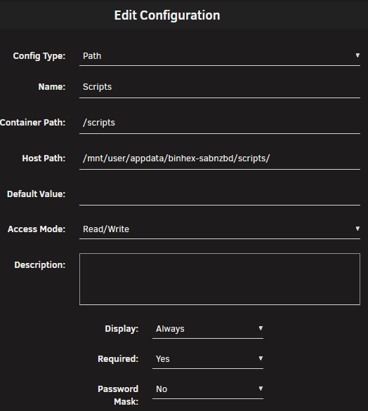
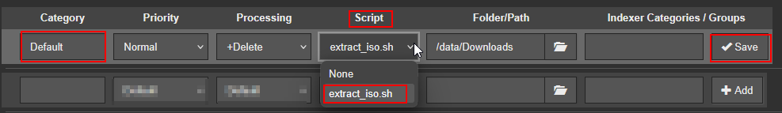
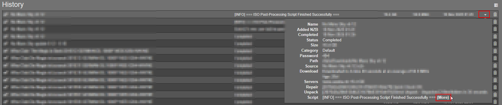

# ISO Extractor Post-Processing Script for SABnzbd

This script automatically extracts `.iso` files after a successful SABnzbd download and removes the original ISO to save space.  
It is intended to be used as a SABnzbd **Post-Processing Script** and works inside Docker-based SABnzbd setups (e.g., Unraid).

## Features

- Detects `.iso` files inside the completed download directory  
- Extracts ISO contents using `7z` or `bsdtar`  
- Deletes the original ISO after successful extraction  
- Provides clean, structured logging with `[INFO]`, `[WARN]`, and `[ERROR]` prefixes  
- Fully compatible with SABnzbd Docker images  
- Supports SABnzbd’s standard post-processing arguments  
- Safe behavior:  
  - Skips on failed downloads  
  - Skips if no ISO files are present  
  - Aborts on extraction errors  

## Requirements

Your SABnzbd Docker container must contain one of the following tools:

- `7z` (recommended, via p7zip)  
- or `bsdtar` (fallback extractor)

Most Linux-based SABnzbd images include `bsdtar` by default.<br>
If you want `7z`, you may need to use a custom Docker image.<br><br>
On Unraid the `binhex-sabnzbd` container does containt `7z`.

## Installation

### 1. Map the script directory

- **Host Path:** `/mnt/user/appdata/{Name of Container}/scripts`
- **Container Path:** `/scripts`
- **Access:** Read/Write

Restart the container afterward.<br>

#### Example:<br>



### 2. Save the script

Save the file as: `/mnt/user/appdata/{Name of Container}/scripts/extract_iso.sh`

### 3. Convert to LF (important!)

If the file was created on Windows or VSCode with CRLF line endings.<br>
Open Terminal on host and execute:
```sed -i 's/\r$//' /mnt/user/appdata/{Name of Container}/scripts/extract_iso.sh```

### 4. Make script executable

Open Shell on host and execute:
`schmod +x /mnt/user/appdata/{Name of Container}/scripts/extract_iso.sh`

### 5. Configure SABnzbd

- Go to `Config` -> `Folders`
  - Set User Script Folder to: `/scripts`
- Go to `Config` -> `Categories`
  - In the `Script` column assign the script to the category you want to process (e.g. `Default`) and click on
    `Save` on the righthand side.


### 6. Logging

- You can view the script output in SABnzbds history when clicking on the small arrow.
- 